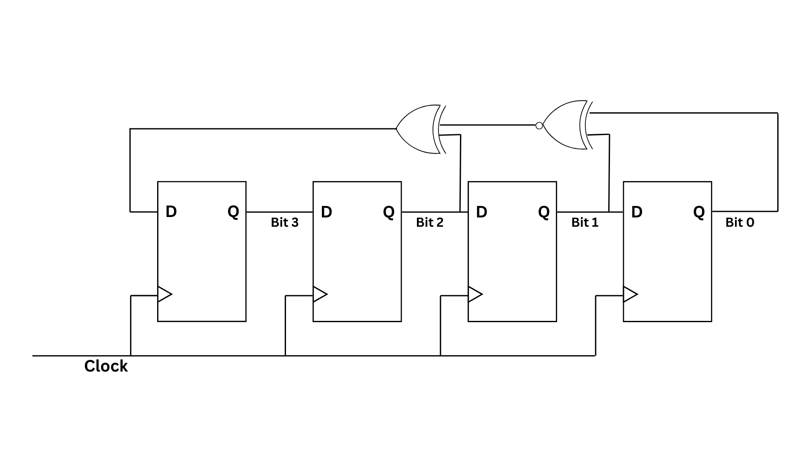

# 4-Bit Linear Feedback Shift Register

A Linear Feedback Shift Register (LFSR) is a sequential shift register whose input bit is a linear function of its previous state. It's often used for generating pseudorandom sequences of bits.  
The lfsr consists of following components: 
1. **Registers**: An LFSR consists of a series of flip-flops, typically arranged in a chain. Each flip-flop holds one bit of information. 
2. **Feedback**: The output of one or more of the flip-flops is connected to the input of the first flip-flop in the chain, creating a feedback loop. 
3. **Clocking**: At each clock cycle, the bits in the register shift to the next flip-flop in the chain. The bit that gets shifted into the first flip-flop is determined by a linear combination of the current bits in the register. 
4. **Periodicity**: LFSRs can generate sequences of bits that appear random but are deterministic. The length of the sequence before it repeats is called the period, and for an $n-bit$ LFSR, the maximum period is $2^n - 1$. 

LFSRs find applications in various fields such as cryptography, error detection, digital signal processing, and even in generating test patterns for digital circuits. They're particularly useful because they're simple to implement in hardware and efficient to run in software.

## Technologies Used
The 4-bit LFSR circuit layout project utilizes the following technologies: 
1. **Xilinx Vivado (Free Version):**
   - Vivado is a widely-used FPGA design and synthesis tool provided by Xilinx. The free version offers essential features for FPGA design, including synthesis, implementation, and simulation capabilities.
   - Verilog hardware description language (HDL) is used to describe the functionality of the 4-bit LFSR circuit within the Vivado environment.

2. **CMOS Technology:**
   - Complementary Metal-Oxide-Semiconductor (CMOS) technology is employed for the physical layout design of the 4-bit LFSR circuit.
   - CMOS technology enables the implementation of digital circuits with low power consumption, high noise immunity, and scalability.

3. **Open-Source Software:**
   - Electric VLSI Design System (Electric) or Magic VLSI Layout Tool may be utilized for schematic capture and layout design.
   - ngspice or LTspice can be used for circuit-level simulations to verify the correctness and performance of the layout design.

4. **Verilog HDL:**
   - Verilog is used as the hardware description language to specify the behavior and structure of the 4-bit LFSR circuit.
   - The Verilog code is synthesized and implemented within the Vivado environment to generate the corresponding digital logic circuit.

These technologies collectively enable the design, implementation, and verification of the 4-bit LFSR circuit layout, facilitating efficient utilization of FPGA resources and adherence to design constraints.

## Contributions

### Overview:
This contribution aims to implement the layout of a 4-bit Linear Feedback Shift Register (LFSR) circuit using CMOS technology. The layout design will adhere to the given block diagram specifications, ensuring efficient use of resources and meeting the desired performance metrics. Open-source software tools will be utilized throughout the design process, promoting accessibility and collaboration within the community.

## Tasks

### 1. Initial Design Exploration
- Analyze the provided block diagram to understand the functionality and requirements of the 4-bit LFSR circuit.
- Research CMOS layout techniques suitable for implementing digital circuits.

### 2. Schematic Capture
- Utilize open-source EDA (Electronic Design Automation) tools such as Electric VLSI Design System (Electric) or Magic VLSI Layout Tool for creating a schematic representation of the 4-bit LFSR circuit.

### 3. Layout Design
- Translate the schematic into a physical layout adhering to CMOS technology rules and design constraints.
- Optimize the layout for area, power consumption, and signal integrity while ensuring functionality.

### 4. Verification and Simulation
- Verify the correctness of the layout design through circuit-level simulations using open-source tools like ngspice or LTspice.
- Perform thorough testing to ensure proper functionality and adherence to design specifications.

### 5. Documentation and Reporting
- Document the design process, including methodologies and simulation results, in the README file.
- Provide clear instructions for replicating the layout design using open-source software tools.
- Include relevant diagrams, screenshots, and performance metrics to illustrate the design process and outcomes.

### 6. Community Engagement
- Seek feedback and input from the open-source community through forums, mailing lists, or social media platforms.
- Encourage collaboration and contributions by making the project accessible and inviting participation from interested individuals.

## Expected Outcome
Upon completion, this contribution will provide a fully implemented layout of the 4-bit LFSR circuit using CMOS technology as an open-source resource. The documentation and design process will serve as educational material for those interested in digital circuit layout and CMOS technology.
